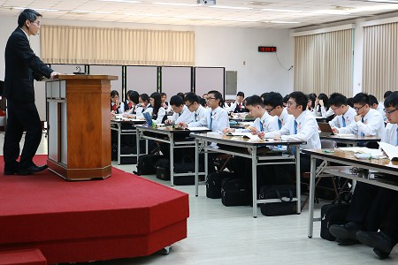

課程介紹
====

『直到我們眾人都達到了信仰上並對神兒子之完全認識上的一，達到了長成的人，達到了基督豐滿之身材的度量』─弗四13。

“Until we all arrive at the oneness of the faith and of the full knowledge of the Son of God, at a full-grown man, at the measure of the stature of the fullness of Christ”─Eph 4:13.

## 核心課程

### 三一神

照着聖經純正的啟示，神只有一位，卻有父、子、靈，這三方面的講究：父是神、子是神、靈是神；父是永遠的、子是永遠的、靈是永遠的；父子靈是永遠到永遠，同時共存、互相內在、不相分離，父子靈三者乃是一，子就是父，子成了賜生命的靈，主就是那靈。然而因着人類語言的缺失，在第二年的課程中，將探討歷代以來對神聖三一研究的演進和偏差，並從聖經各卷書證明並看見神是三一的。使我們知道神格的三一，不是為着人在道理上領會系統的神學，乃是為着神在祂的三一裏，把祂自己分賜到所揀選並救贖的人裏面，使他們在三一神裏面成為一，且與三一神成為一。

### 神的經綸

『經綸』一字的原文是『家庭律法』，含分配意，因此引伸為行政－分配－的安排，所以也是家庭經營。所以『神的經綸』就是『神的家庭經營』、『神的家庭行政』，就是要在基督裏將祂自己分賜到祂所揀選的人裏面，使祂得着一個家彰顯祂自己，這家就是召會，基督的身體。這就是聖經主要的啟示。這神聖經綸的中心與普及，乃是包羅萬有且追測不盡之豐富的基督，而神聖經綸的目標，乃是召會作基督的身體、基督的豐滿和彰顯，終極完成於新耶路撒冷，作經過過程並終極完成之三一神，與祂所救贖、重生、變化、並榮化之三部分人的聯結、調和與合併。

### 基督豐滿的職事

基督豐滿的職事，乃是為着成就神永遠的經綸，完成於三個時期：

第一個時期，成肉體的時期，首先，將無限的神帶到有限的人裏面；第二，將三一神並與三部分人聯結、調和並合併；第三，藉祂芬芳的美德，在他的人性裏彰顯全備之神豐富的屬性；第四，完成祂包羅萬有之法理的救贖。 第二個時期，總括的時期，生為神的長子，成為賜生命的靈，並為着祂的身體重生信徒。 第三個時期，加強的時期，加強祂生機的救恩，產生得勝者，並完成新耶路撒冷。

### 那靈

在聖經中，有關『靈』的啟示是漸進的。頭一次說的是在創造裏神的靈，其次是在神與人關係中耶和華的靈。而後是有聖靈、生命的靈、賜生命的靈、耶穌的靈、基督的靈和耶穌基督的靈等。這一切的名稱，啟示出了這神聖的靈不同的功用。至終，這靈成了神的七靈，要在地上完成神的行政，使神關乎召會的經綸得以成就。藉着那靈這門課，使我們認識如今這一個包羅萬有的靈，已成了信徒全備的供應，而使信徒能彀經歷並顯大基督。

### 基督的身體

在舊約裏作神居所之物質的帳幕和殿，實際上乃是表徵團體的百姓，就是以色列人作神的家。在新約時代開頭，成為肉體的基督作為神的具體化身，是神的帳幕和神的殿。藉着死與復活，個人的基督擴大成為團體的基督，就是新約信徒所組成的召會，作為神的殿，神的家和基督的身體。因此，神照着祂美意而有的永遠經綸，就是將祂自己分賜到祂所揀選並救贖的人裏面，使他們都在生命和性情上，但不在神格上，與祂一模一樣，使他們成為祂的複製，以彰顯祂。這樣一個神聖分賜的結果，乃是召會作基督的身體。這身體要終極完成於新耶路撒冷，作為神成肉體的擴大和擴增，達到完滿的總結，就是三一神的豐滿，直到永遠。

### 新耶路撒冷

新耶路撒冷不僅是全聖經的結束，也是聖經中所啟示一切重要項目的終極完成。三一神、三一神的經綸、基督的救贖、神的救恩、信徒、召會以及國度，都終結於新耶路撒冷這總結的一項裏。如此，說這新耶路撒冷乃是一座物質的城，是不合邏輯的。照全部聖經整體的啟示看，這作全部聖經結論的新耶路撒冷，乃是經過過程的三一神，與蒙救贖、得變化的三部分人，一個神性調人性的神聖調和，成為一個宇宙團體的奧祕人位。這人位乃是：羔羊的妻子；神的帳幕和聖殿的終極完成，作神與人永遠的互居之所；神歷代在舊造中之新造的終極完成和神永遠的經綸和祂神聖的成就終極的完結。藉着這門課深入新耶路撒冷中的每個細節，使我們在今天的生活中就能活出並作新耶路撒冷。

## 基礎課程

### 性格

性格的組成是生性加上習性。性情是天生的，性格是養成的。一個人的性格生性只有百分之三十，習性卻有百分之七十。一個人有甚麼用處，能接受甚麼託付，承擔甚麼責任，作甚麼事情，百分百是根據於他的性格。所以青年人必須特別注意性格的養成。在訓練第一年『性格』的課程，重在開啟性格與真理、生命、事奉之關聯的重要性，並認識性格三十點－真準緊、勤大細、穩忍深等性格。並且交通性格要得着變化，需要運用意志與主配合，且有一個積極進取的態度以操練性格。第二年根據『主工人的性格』一書，論到一個為主作工的人所需養成的性格。訓練中心規律又緊湊的時間表、各樣的表單及點名單，都使學員操練準時、確實；內務的操練也使我們學習細心不馬虎，更在身體裏配搭，建立敞開的性格。諸如此類的操練，都使我們在性格上被建立，成為合乎主使用的器皿。

### 生命的經歷與長大

整本聖經，特別是新約，乃是說到生命。宇宙中只有一個生命是永遠的，這永遠的生命就是神的生命，甚至就是神自己。新約的信徒不僅藉重生得着這神聖的生命，更要經歷這生命，並在這生命中長大成熟。本課程使我們看見基督徒生命經歷與長大的重要因素：人的受造與神的器皿、神對人的心意、撒但破壞人的計謀、人的墮落與神生命的救恩、生命的定義、何謂生命的經歷與長大、生命的交通、生命的感覺、生命之靈的律、三一神將神聖的生命分賜到人的三部分裹、靈的感覺與認識靈、認識人的靈和為着敬虔操練我們的靈。藉着本課程使我們在光中認識自己，並認識那攔阻屬靈生命長進的難處；更開啟基督活的人位連同祂死而復活的歷史，成為信徒每日的經歷，以帶進生命真實的長大，達到神救恩的終極目的。

### 神命定之路

神要一個生機體，而這個生機體是藉由生、養、成全、申言而產生並建造起來的。因此在課程的設計上，第一年開啟學員要迫切並專一為福音而活，並且成全學員背負、懷揣神的百姓，關心人的屬靈幸福，並指導學員如何設立家聚會，操練在耶穌的人性裏顧惜人，並在基督的神性裏餧養人。因此每週至少十小時的開展也成了學員事奉方面的主要操練。在第二年的課程裏，傳輸活力排的負擔，看見要成為滿了活力的人，為着召會的繁增外出接觸人，使人也成為有活力的；並且交通申言各方面的認識，看見申言是為着建造基督身體極超越的恩賜，使學員切慕為主說話，並學習正確、合式的在聚會中說話，供應基督以建造召會。

### 聖經綱領

聖經是由舊約和新約二約組成，其主要的啟示，乃是獨一的三一神惟一的神聖經綸。在舊約裏，神經綸的內容主要是以豫表、表號、和影兒啟示出來；在新約裏，這一切的應驗並實現。因此，舊約是神永遠經綸的象徵描繪，新約是它實際的應驗。而訓練中心所安排聖經綱領的課程，從根基、架構、輪廓開始，認識每卷聖經中每卷書的中心線都是論到神的經綸，使學員對整本聖經有鳥瞰的眼光。

### 召會歷史、歷史與啟示

從初期的召會開始，經過改教運動等歷程，到了現今的宗派林立。召會歷史的進程，正驗證了聖經中的神聖的啟示：神在祂選民中的行動，匯集成主恢復的水流，這恢復水流的歷史，傳達神與祂時代安排的神聖啟示。藉從『召會歷史』和『歷史與啟示』的課程，讓學員從歷史中看見這一道獨一恢復的水流，並使學員從歷史來看見啟示的寶貴，也看歷史如何一步一步用事實來印證這啟示。

### 英文、希臘文

訓練中的語言課程，包含了英文和聖經希臘文，其目的在培養學員們使用流利英文溝通，以及研讀聖經時查閱希臘原文的能力。在英文課程的設計上，第一年根據學員們英語程度的不同，給予所需要的幫助，使學員們均衡的在聽、說、讀、寫等方面受成全。第二年的課程要求學員們在聆聽英文信息之後，撰寫申言稿，並操練用靈講說，大量加強學員們『說』的能力。在一學期一次的英文加強週裏，學員生活中全程使用英文，長時間浸透在英語環境中。另外，希臘文課提供發音和基礎文法的學習，並培養學員使用工具書查讀希臘原文的能力。更藉着聖經中重要字辭的字義研究實作，使學員應用所學，並更加珍賞這分時代職事所供應的真理。

## 其他

### 事奉主者的人格

從聖經中看見：事奉主者人格的意義與重要、認識事奉主者人格的內容、人格出問題的原因。 從歷史中看見：倪柝聲弟兄的人格、李常受弟兄的人格、從歷次風波看背叛者失去人格的原因。 總結：事奉主者要愛主，人格纔有保障、高峰真理與十字架並行、需要看見基督的身體。

### 論文寫作

基督徒在地上不只需要愛神、認識神和服事神，並且還有着一分託付，就是要將真理向着世人和教會解釋並說明，當『有人問你們心中盼望的緣由，就要常作準備，以溫柔敬畏的心回答各人。』（彼前三15。）全時間訓練中心，係由李常受弟兄於一九八六年在台開辦，希望藉着訓練，使信徒能被真理裝備，藉着聖靈的啟示，認識神聖的真理，並看見『神成為人，人成為神』之聖經啟示的高峰。故此，在第二年課程的安排上，要求學員能藉由真理論文的撰寫，從倪柝聲和李常受的着作中，深掘此一真理的高峰，使之能與真理同歡樂，至終在至聖的信仰上建立自己，並為真理打那美好的仗。

### 新約的職事

全本聖經只有兩種職事。一種稱為舊約的職事（林後三7，9，14），另一種稱為新約的職事（6）。實際上，這兩種職事就是一個，舊約的職事是豫備、影兒、豫像，新約的職事則是應驗。舊約裏所發生的乃是新約職事裏所要發生之事的影兒。因此，新約職事是舊約職事的應驗。在已過數個世紀裏，基督徒中間所發生的一切分裂和混亂，都是出自一個源頭，就是容忍不同的職事。因此在課程的設計上，我們要來看主在祂的恢復裏何為新約的職事。其次，我們需要來看在主的恢復裏，今日的異象是甚麼。並且看見執行這異象的路等。這些都是極其要緊的事，保守我們能在正確的根基上，用正確的材料，繼續建造。

### 職事信息

回顧以往，歷代以來雖有許多愛主、服事主的人興起，卻因着所持的異象不同而無法同心合意。主的恢復就是恢復新約獨一的職事，這職事向我們揭示神的經綸，就是三一神要在基督裏分賜到祂的選民裏面，使他們成為祂活的肢體形成基督的身體，終極完成於新耶路撒冷。因此在訓練的課程設計上，帶領學員進入一年七次特會訓練，藉着直接觀看錄影信息，緊緊跟隨主今時代的說話，再由教師逐篇帶領禱研背講，使學員能進入信息負擔，並被屬天的新語言重新構成。期間課程則安排『新約的職事』，『歷史與啟示』和『召會歷史』，藉此讓學員從歷史中看見這一道獨一恢復的水流，並使學員珍賞這分時代的職事向我們所揭示的時代異象。
